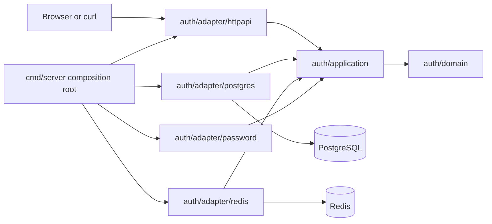

# Backend setup and login design

Status: draft for user review. This document designs the accepted backend-only milestone; it does not authorize implementation.

## 1. Design goals

The generated application must provide one complete backend loop:

1. an operator configures the generated project and runs migrations explicitly;
2. the ordinary API startup creates a temporary setup link while setup is incomplete;
3. the setup API creates exactly one initial administrator and durably closes setup;
4. the administrator logs in with email and password;
5. a server-side Redis session authorizes `GET /api/auth/me`;
6. logout revokes the current session.

The design keeps Temvia out of the generated application's runtime, keeps `template/admin` unchanged, preserves the existing `GET /health` contract, and avoids speculative identity features.

## 2. Architecture decision

Use a modular monolith with one `auth` business module. Within that module, DDD supplies domain language and invariants, application components orchestrate use cases, and Hexagonal ports isolate PostgreSQL, Redis, Argon2id, and random generation.

This is deliberately smaller than textbook Clean Architecture. It preserves one source dependency rule without creating a package for every ring.



Runtime calls flow from HTTP through application code to adapters. Source dependencies point inward: domain imports no adapter; application owns the ports it consumes; adapters import application/domain contracts; `cmd/server` imports and wires concrete implementations.

## 3. Generated project layout

The exact filenames may shift during implementation if tests reveal a clearer split, but package ownership must remain as follows:

```text
<generated-project>/
├── .env.example
├── Makefile
├── compose.yaml
├── README.md
├── admin/                         # unchanged in this milestone
└── api/
    ├── Dockerfile
    ├── go.mod
    ├── go.sum
    ├── migrations/
    │   ├── 000001_auth.up.sql
    │   ├── 000001_auth.down.sql
    │   └── Dockerfile
    ├── cmd/server/
    │   ├── main.go
    │   └── main_test.go
    └── internal/
        ├── config/
        │   ├── config.go
        │   └── config_test.go
        └── auth/
            ├── domain/
            │   ├── administrator.go
            │   ├── credentials.go
            │   └── credentials_test.go
            ├── application/
            │   ├── setup.go
            │   ├── authentication.go
            │   ├── ports.go
            │   └── *_test.go
            └── adapter/
                ├── httpapi/
                │   ├── routes.go
                │   ├── setup.go
                │   ├── authentication.go
                │   ├── json.go
                │   ├── problem.go
                │   └── *_test.go
                ├── postgres/
                │   ├── store.go
                │   ├── setup.go
                │   ├── accounts.go
                │   └── *_test.go
                ├── redis/
                │   ├── sessions.go
                │   ├── limiter.go
                │   ├── scripts.go
                │   └── *_test.go
                └── password/
                    ├── argon2id.go
                    └── argon2id_test.go
```

There are no generic `handler`, `service`, `repository`, `entity`, `usecase`, or `ports` package buckets. Concrete types may still use those words when they accurately describe a role.

Shared HTTP helpers stay in the auth HTTP adapter for now. They should move to a project-level package only after a second module establishes an actual shared contract.

## 4. Domain and application model

### 4.1 Domain values

The domain package owns pure validation and normalization for:

- `Name`: trimmed, NFC-normalized, 1-100 Unicode code points, single-line, and without control characters;
- `Email`: conservative ASCII mailbox syntax, preserved display value, and lowercase canonical value;
- `Password`: NFC-normalized and 15-128 Unicode code points;
- `Administrator`: public ID, name, display email, and creation time;
- setup state: `required` or `complete`.

Passwords, setup tokens, and session IDs are credentials, not entity identity. Their raw values must not be printable domain fields.

### 4.2 Application components

`Setup` owns:

- reading coarse setup status;
- issuing/replacing the startup setup credential;
- validating a submitted credential cheaply;
- hashing the initial password outside a transaction;
- atomically creating the administrator and closing setup.

`Authentication` owns:

- login limiting;
- account lookup and password verification;
- creating a fresh session;
- resolving and touching the current session;
- current-session logout.

### 4.3 Application-owned ports

Ports are narrow and use business-shaped inputs/results. Representative operations are:

- `SetupStore.Status`
- `SetupStore.ReplaceCurrentToken`
- `SetupStore.PreflightToken`
- `SetupStore.Complete`
- `AccountStore.FindByCanonicalEmail`
- `AccountStore.FindPublicByID`
- `PasswordHasher.Hash` and `PasswordHasher.Verify`
- `SessionStore.Create`, `SessionStore.ResolveAndTouch`, and `SessionStore.Delete`
- `LoginLimiter.Allow` and `LoginLimiter.ResetEmail`
- a cryptographic random-byte source used for setup and session credentials.

`SetupStore.Complete` is transaction-shaped. It revalidates setup and token state, inserts the first administrator, closes setup, and removes the token in one PostgreSQL transaction. The application never receives `*sql.Tx` or a generic Unit of Work.

Adapters map driver errors to a small application error vocabulary such as setup complete, invalid setup credential, account not found, invalid session, rate limited, and dependency unavailable. HTTP status codes remain an HTTP-adapter concern.

## 5. PostgreSQL design

### 5.1 Tables

The first migration creates two auth-owned tables.

`auth_setup` is a singleton row:

| Column | Type | Purpose |
| --- | --- | --- |
| `singleton` | boolean primary key | fixed `true`, enforces one row |
| `token_digest` | bytea nullable | SHA-256 digest of current setup token |
| `token_expires_at` | timestamptz nullable | database-authoritative expiry |
| `completed_at` | timestamptz nullable | durable setup closure |

The migration inserts the singleton row with no token and incomplete state. Constraints require digest and expiry to be both null or both present, and require them to be null after completion.

`auth_users` stores the initial administrator and leaves room for later account work without introducing roles now:

| Column | Type | Purpose |
| --- | --- | --- |
| `id` | uuid primary key | generated by PostgreSQL 18 with `uuidv7()` |
| `name` | text | normalized display name |
| `email` | text | preserved trimmed display email |
| `email_canonical` | text unique | lowercase login identity |
| `password_hash` | text | bounded Argon2id PHC string |
| `created_at` | timestamptz | database creation time |

Application validation remains authoritative for the detailed Unicode/email grammar. Database checks enforce cheap structural bounds and canonical-email uniqueness as a final consistency barrier.

### 5.2 Setup serialization

Startup opens a short transaction and locks the singleton row. If setup is complete, it creates no token. Otherwise it atomically replaces the digest and expiry using PostgreSQL time, commits, and then logs the matching link once. Concurrent API startups serialize; the last committed token is authoritative and earlier logged links become invalid. The default Compose topology runs one API replica.

Setup completion follows this order:

```mermaid
sequenceDiagram
    participant H as HTTP adapter
    participant S as application.Setup
    participant P as PostgreSQL adapter
    participant A as Argon2id adapter

    H->>S: Complete(token, name, email, password)
    S->>P: PreflightToken(SHA-256(token))
    P-->>S: current and unexpired
    S->>A: Hash(normalized password)
    A-->>S: PHC string
    S->>P: Complete(expected digest, administrator data)
    Note over P: BEGIN; SELECT singleton FOR UPDATE;<br/>revalidate; INSERT user; UPDATE setup; COMMIT
    P-->>S: public administrator
    S-->>H: setup complete
```

An invalid token never triggers Argon2id. A valid preflight does not guarantee completion: the transaction rechecks state so concurrent or replayed submissions cannot create a second administrator.

### 5.3 Schema readiness

The API never runs migrations. Startup reads `schema_migrations`, rejects a dirty database, and requires the exact migration version compiled for that API release. A missing table, dirty state, unexpected version, or database connection failure stops API startup with a safe operator-facing error and no schema writes.

The expected migration version is kept in one Go constant with a test that compares it to the highest bundled migration filename.

### 5.4 `database/sql`

The PostgreSQL adapter uses `database/sql` with `pgx/v5/stdlib`. It configures:

- maximum open connections: 10;
- maximum idle connections: 5;
- maximum idle time: 5 minutes;
- maximum lifetime: unlimited (`0`).

All operations use request/startup contexts. Transactions use `BeginTx`, explicit rollback on every incomplete path, and commit only after all invariant-changing statements succeed.

## 6. Password adapter

The adapter uses `golang.org/x/crypto/argon2` with Argon2id parameters `m=65536 KiB`, `t=3`, and `p=4`, a fresh 16-byte cryptographic salt, and a 32-byte tag. It stores a self-describing PHC string.

The parser validates algorithm, version, positive numeric fields, exact accepted parameter bounds, salt length, tag length, and encoded-size bounds before allocating Argon2 memory. Verification compares tags in constant time.

One process-wide immediate-acquisition semaphore limits both setup hashing and real login verification. The default concurrency is 2. Saturation returns dependency-unavailable behavior without queuing or allocating more Argon2 memory. Unknown-email login performs no dummy hash under the accepted security freeze.

## 7. Redis design

Redis is an ephemeral authority for sessions and login counters. It has no AOF, RDB snapshots, or data volume. Restarting Redis invalidates every session but does not affect PostgreSQL accounts or setup state.

### 7.1 Key namespaces

- `temvia:v1:session:<sha256-hex>`
- `temvia:v1:limit:login:global`
- `temvia:v1:limit:login:email:<sha256-hex>`

Every application-owned key has finite TTL. Raw session IDs and plaintext emails never appear in keys or values.

### 7.2 Sessions

A raw session ID is 32 random bytes encoded as unpadded Base64URL in the cookie. Redis receives only its SHA-256 digest. The Redis Hash contains:

- `user_id`
- `created_at_ms`
- `last_seen_at_ms`
- `absolute_expires_at_ms`

Session creation and validation/touch use project-owned Lua scripts and Redis `TIME`. Validation verifies existence and absolute expiry, updates `last_seen_at_ms`, and sets TTL to the earlier of the 30-minute idle deadline and 12-hour absolute deadline. A touch updates an existing key only and can never recreate a deleted session.

Deletion uses idempotent `DEL`. Acknowledged deletion is final in the in-memory model. A missing key is unauthenticated/idempotently logged out; an uncertain command result returns `503`.

The go-redis `Script` helper uses `EVALSHA` with source fallback. Redis Functions are unnecessary for this small deployment.

### 7.3 Login token buckets

One Lua script uses Redis `TIME` to atomically refill, test, and consume both the global and canonical-email buckets. Both buckets must allow the request. State stores token count and last-refill time; TTL is long enough for the bucket to refill completely and then expire.

The default policies are:

- global: capacity 10, one token per 6 seconds;
- canonical email: capacity 5, one token per minute.

A denied request returns generic `429` before account lookup or Argon2id. A successful login clears the email bucket but not the global bucket. Redis uncertainty returns `503`.

### 7.4 Operation budget and recovery

Each Redis adapter operation receives a total deadline from `REDIS_OPERATION_TIMEOUT`, default one second. There is at most one retry for a retry-safe transient connection error inside the same deadline. Client dial/read/write settings and retry count may be stricter but cannot extend it.

Redis failure never terminates an already-running API process. Redis-backed login, current-session, and uncertain logout operations fail closed with `503`; PostgreSQL-only setup routes continue. Later requests reconnect automatically after Redis returns.

## 8. HTTP contract

### 8.1 Routes

| Method | Route | Authentication | Success |
| --- | --- | --- | --- |
| `GET` | `/health` | none | existing `200 {"status":"ok"}` contract |
| `GET` | `/api/setup/status` | none | `200 {"status":"required"}` or `{"status":"complete"}` |
| `POST` | `/api/setup` | setup token in JSON | `201 {"status":"complete"}` |
| `POST` | `/api/auth/login` | email/password in JSON | `200 {"user":{...}}` plus session cookie |
| `GET` | `/api/auth/me` | session cookie | `200 {"user":{...}}` |
| `POST` | `/api/auth/logout` | current session if present | `204` and expired cookie |

Setup request:

```json
{"token":"...","name":"Ada Lovelace","email":"ada@example.com","password":"..."}
```

Login request:

```json
{"email":"ada@example.com","password":"..."}
```

The public user representation is exactly:

```json
{"user":{"id":"019535d9-3df7-79fb-b466-fa907fa17f9e","name":"Ada Lovelace","email":"ada@example.com"}}
```

### 8.2 JSON request rules

Setup and login require `Content-Type: application/json`. An optional `charset=utf-8` parameter is accepted; unknown media types, invalid parameters, or a non-UTF-8 charset return `415`.

The wire body limit is 65,536 bytes. The adapter checks declared length and wraps the body so chunked input cannot bypass the limit. Oversize takes precedence once the limit is observed and returns `413`.

The strict decoder accepts exactly one top-level object and trailing JSON whitespace. It explicitly rejects duplicate keys, unknown keys, arrays/scalars/null, empty or truncated bodies, and a second JSON value with `400`. Recognized fields with ordinary missing/invalid values return field-level `422`; a missing or malformed setup token retains the non-enumerating `403` contract.

### 8.3 Origin and cookies

All unsafe methods in this milestone require an `Origin` header that exactly matches the normalized origin of `APP_PUBLIC_URL`, including scheme, host, and effective port. Missing, `null`, malformed, or mismatched origins return `403`. No permissive credentialed CORS headers are emitted.

Production HTTPS cookie:

```text
__Host-temvia_session=<credential>; Path=/; Secure; HttpOnly; SameSite=Lax
```

Development HTTP cookie uses `temvia_session` and omits `Secure`; all other attributes remain. The session cookie has no `Domain`, `Expires`, or `Max-Age` attribute, so browser persistence and server authorization lifetimes stay separate.

Logout always emits the matching expired cookie after an authoritatively safe/idempotent outcome. If deletion is uncertain, it returns `503` and leaves the cookie intact so revocation can be retried.

### 8.4 Response and cache policy

All setup/auth success and error responses include `Cache-Control: no-store`. JSON is UTF-8 and written with a trailing newline. `204` responses contain no body or content type.

Cookie authentication does not advertise Basic or Bearer authentication, so `401` responses omit `WWW-Authenticate`. The first version omits `Retry-After`: the limiter intentionally does not disclose a precise reset schedule, and dependency recovery time is unknown.

`http.ServeMux` remains the router. Method fallbacks for each API path return Problem Details `405`; `/api/` fallback returns Problem Details `404`. The existing `/health` behavior remains covered by its existing tests.

### 8.5 Problem Details registry

Every API failure uses `application/problem+json` and a body containing stable `type`, `title`, and numeric `status`. `detail` is omitted unless a safe corrective explanation is useful.

| Status | Type | Title |
| --- | --- | --- |
| 400 | `/problems/invalid-request` | `Invalid Request` |
| 401 | `/problems/invalid-credentials` | `Invalid Credentials` |
| 401 | `/problems/unauthenticated` | `Unauthenticated` |
| 403 | `/problems/forbidden` | `Forbidden` |
| 403 | `/problems/invalid-setup-token` | `Invalid Setup Token` |
| 404 | `/problems/not-found` | `Not Found` |
| 405 | `/problems/method-not-allowed` | `Method Not Allowed` |
| 409 | `/problems/setup-complete` | `Setup Complete` |
| 413 | `/problems/content-too-large` | `Content Too Large` |
| 415 | `/problems/unsupported-media-type` | `Unsupported Media Type` |
| 422 | `/problems/validation-failed` | `Validation Failed` |
| 429 | `/problems/rate-limited` | `Too Many Requests` |
| 500 | `/problems/internal-error` | `Internal Server Error` |
| 503 | `/problems/service-unavailable` | `Service Unavailable` |

Rate limiting also emits `"code":"rate_limited"`. Validation adds:

```json
{
  "type": "/problems/validation-failed",
  "title": "Validation Failed",
  "status": 422,
  "errors": [
    {"pointer": "/email", "code": "invalid_email"}
  ]
}
```

Pointers identify request fields. Codes and optional primitive `params` are stable translation inputs for the future frontend. Responses never echo password, token, cookie, raw body, SQL, Redis, stack, or internal error data.

User IDs use PostgreSQL-generated UUIDv7 values and are serialized in canonical lowercase UUID text. HTTP clients treat the value as opaque and must not derive authorization or ordering from its embedded timestamp.

## 9. Request flows

### 9.1 API startup

1. Parse and validate all configuration before opening listeners.
2. Open PostgreSQL through `database/sql`, configure the pool, and ping with a startup deadline.
3. Verify the exact clean migration version without writing schema state.
4. Create the Redis client configuration. Redis may be unavailable at this moment; that does not block setup-capable API startup.
5. If setup is incomplete, generate 32 random bytes, persist only SHA-256 plus database-time expiry, and log `${APP_PUBLIC_URL}/setup#token=<base64url>` once.
6. Compose dependencies, start `http.Server`, and handle graceful shutdown.

If PostgreSQL or schema readiness fails, startup stops. If token persistence fails, startup stops because the operator would otherwise receive no usable setup authority.

### 9.2 Login

1. Enforce Origin, media type, size, and strict JSON shape.
2. Normalize and syntactically validate email; validate password bounds without revealing account state.
3. Atomically consume both Redis limiter buckets.
4. Look up canonical email in PostgreSQL.
5. Return the generic credential problem immediately for an unknown email; do not run dummy Argon2id.
6. Acquire the Argon2id semaphore immediately and verify a known account password.
7. On success, create a fresh session credential and reset the email limiter state.
8. Set the cookie and return the public user.

Any Redis uncertainty before an authoritative success returns `503`. A known wrong password and an unknown email share the same status/body, though whole-request timing is not claimed to be equal.

### 9.3 Current session and logout

`GET /api/auth/me` strictly decodes the cookie credential, hashes it, and invokes atomic resolve/touch. Missing or invalid state is `401`; Redis uncertainty is `503`; success loads and returns the current public user and refreshes idle expiry.

`POST /api/auth/logout` enforces Origin first. No/malformed/authoritatively absent sessions return idempotent `204` and clear stale cookie state. A valid-looking credential is cleared only after Redis acknowledges deletion. Atomic touch never recreates the key.

## 10. Configuration and deployment

The root `.env.example` is the complete supported inventory. Non-sensitive values have defaults; secrets are empty. Root `.env` is ignored, recommended mode `0600`, and loaded by Compose. Go code reads process environment only and does not parse `.env` files.

The planned variables are:

| Variable | Example/default | Rule |
| --- | --- | --- |
| `APP_ENV` | `development` | exactly `development` or `production` |
| `APP_PUBLIC_URL` | `http://localhost:5173` | canonical origin; HTTPS required in production |
| `HTTP_ADDR` | `0.0.0.0:8080` | API listen address in container |
| `API_PORT` | `8080` | host loopback publication |
| `SETUP_LINK_TTL` | `30m` | positive duration |
| `GOPROXY` | `https://proxy.golang.org,direct` | optional API image build-time Go module proxy |
| `POSTGRES_HOST` | `postgres` | PostgreSQL client host; Compose service by default |
| `POSTGRES_PORT` | `5432` | PostgreSQL client/service port |
| `POSTGRES_HOST_PORT` | `5432` | host loopback publication only |
| `POSTGRES_DB` | `temvia` | non-empty conservative database name |
| `POSTGRES_USER` | `temvia` | non-empty conservative role name |
| `POSTGRES_PASSWORD` | empty | required secret, passed through without trimming |
| `POSTGRES_SSLMODE` | `disable` | Compose-local default; production override allowed |
| `DB_MAX_OPEN_CONNS` | `10` | positive |
| `DB_MAX_IDLE_CONNS` | `5` | non-negative and not above open maximum |
| `DB_CONN_MAX_IDLE_TIME` | `5m` | non-negative duration |
| `DB_CONN_MAX_LIFETIME` | `0s` | non-negative; zero means unlimited |
| `REDIS_ADDR` | `redis:6379` | API client address on the Compose network |
| `REDIS_PORT` | `6379` | host loopback publication only |
| `REDIS_PASSWORD` | empty | required non-empty secret, byte-for-byte |
| `REDIS_MAXMEMORY` | `128mb` | Redis dataset ceiling |
| `REDIS_CONTAINER_MEMORY_LIMIT` | `256m` | must exceed dataset ceiling |
| `REDIS_OPERATION_TIMEOUT` | `1s` | positive duration |
| `SESSION_IDLE_TIMEOUT` | `30m` | positive and less than absolute timeout |
| `SESSION_ABSOLUTE_TIMEOUT` | `12h` | positive |
| `PASSWORD_HASH_MAX_CONCURRENCY` | `2` | positive integer |
| `LOGIN_RATE_LIMIT_GLOBAL_CAPACITY` | `10` | positive integer |
| `LOGIN_RATE_LIMIT_GLOBAL_REFILL_INTERVAL` | `6s` | positive duration |
| `LOGIN_RATE_LIMIT_EMAIL_CAPACITY` | `5` | positive integer |
| `LOGIN_RATE_LIMIT_EMAIL_REFILL_INTERVAL` | `1m` | positive duration |

Compose maps PostgreSQL/Redis host ports to `127.0.0.1` only. API-to-service traffic uses the private Compose network. `POSTGRES_HOST_PORT` may change without changing the API's internal `POSTGRES_PORT`; similarly, `REDIS_PORT` does not change `REDIS_ADDR`. The API and migration services receive standard PostgreSQL `PGHOST`, `PGPORT`, `PGDATABASE`, `PGUSER`, `PGPASSWORD`, and `PGSSLMODE` values derived from the table above. This lets the migration URL omit credentials, so arbitrary password characters are not interpolated into a URL or duplicated in `.env`.

Services:

- `postgres`: `postgres:18.6-trixie`, persistent volume mounted at `/var/lib/postgresql`;
- `redis`: `redis:8.10.1-trixie`, `requirepass`, `save ""`, `appendonly no`, `volatile-lru`, memory ceilings, and no volume;
- `migrate`: project-owned image derived from `migrate/migrate:v4.19.1`, containing only the release's external SQL files, run as an explicit one-shot profile/task;
- `api`: project-owned multi-stage Go image; it never contains migration execution logic.

Thin Make targets expose, at minimum, `up`, `down`, `logs`, `migrate-up`, `migrate-down-one`, `test`, and `build`. Documentation emphasizes the safe upgrade sequence: stop API, back up PostgreSQL, run the target release's `migrate-up`, and start API only after success. Destructive down migration is never automatic.

## 11. Logging and secret handling

Normal logs may contain route-independent dependency categories and safe operation context, but never credentials or request bodies. The one setup link is an intentional exception: it is emitted once after successful token replacement and must be clearly labeled as temporary deployment authority.

Do not log:

- setup token/digest except the one startup link's raw fragment;
- email limiter input or plaintext email in limiter diagnostics;
- password or PHC string;
- raw session cookie or digest;
- PostgreSQL/Redis credentials or resolved DSNs;
- SQL parameter values, stack traces, or Redis command payloads in client responses.

## 12. Verification strategy

### 12.1 Unit tests

- name, email, and password normalization/validation, including Unicode and boundary cases;
- PHC generation, bounded parsing, correct/wrong verification, fresh salt, and semaphore saturation;
- Setup and Authentication orchestration with narrow fakes;
- strict JSON duplicate/unknown/body-limit/media-type behavior;
- Origin matching, cookie attributes, Problem Details mapping, and no-store headers.

### 12.2 PostgreSQL integration tests

- migrate up/down against PostgreSQL 18;
- clean/exact/dirty/missing schema readiness;
- setup token replacement and expiry using database time;
- concurrent setup completion creates exactly one user and closes setup;
- canonical email uniqueness and transaction rollback.

### 12.3 Redis integration tests

- session create, resolve/touch, idle/absolute expiry, deletion, and no resurrection;
- atomic limiter behavior under concurrency, finite TTL, and hashed email keys;
- command deadlines and safe Redis-unavailable behavior;
- Redis restart invalidates sessions because persistence is disabled.

### 12.4 HTTP and generated-output tests

- all accepted success and Problem Details contracts;
- curl-compatible cookie and Origin flow;
- existing health tests remain green;
- generator required-file inventory includes new root/API files;
- npm pack, offline generation, generated `go test ./...`, and unchanged admin bytes;
- Compose config validation and a backend smoke flow on Centaurus after one-way rsync, with the API port forwarded for local verification.

## 13. Explicitly deferred security and product work

This design stops at the accepted baseline. A separate task may later evaluate dummy Argon2id timing equalization, MFA, mailbox verification, password recovery, periodic session rotation, device/session management, Redis ACL/TLS/persistence or instance separation, gateway/IP limits, CAPTCHA/risk scoring, and monitoring/health systems.

The future frontend task owns the setup and login pages, setup-fragment extraction/cleanup, routing, client auth state, and browser end-to-end behavior.
