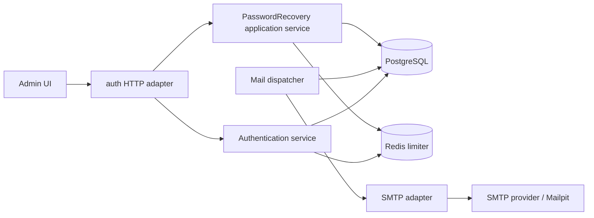

# Forgot password flow design

Status: approved for implementation on 2026-09-01.

## 1. Design goals

The generated application must let a signed-out user recover an email/password
account without exposing whether the account exists, blocking the request on
SMTP, storing a raw reset credential, or leaving old sessions authorized after
the password changes.

The complete runtime loop is:

```text
request recovery
  -> atomically store reset state + mail job
  -> return a generic accepted response
  -> background dispatcher sends the reset email through SMTP
  -> user opens a fragment-token link and chooses a new password
  -> atomically change the password + invalidate old sessions + queue notice
  -> background dispatcher sends the password-changed notice
  -> user signs in normally with the new password
```

The design preserves the existing modular-monolith and clean/hexagonal
boundaries. It deliberately does not add a message broker or a separate worker
deployment.

## 2. Architecture decision

Use a PostgreSQL transactional outbox as the durable hand-off between auth
transactions and an in-process mail dispatcher.



The outbox is required even if a broker is introduced later because reset
state and its mail intent must commit in one database transaction. If future
requirements justify a broker, the dispatcher can publish claimed outbox jobs
to it instead of calling SMTP; the auth transaction and HTTP contracts remain
unchanged.

The in-process dispatcher is sufficient now because password recovery is
strictly rate-limited and low-volume. PostgreSQL leasing with `FOR UPDATE SKIP
LOCKED` lets multiple API replicas cooperate without duplicate concurrent
ownership of the same job.

## 3. Module ownership and files

The capability remains inside `internal/auth`:

```text
template/api/internal/auth/
├── domain/
│   └── credentials.go             # existing password/email rules; reset token shape
├── application/
│   ├── password_recovery.go       # request and complete use cases
│   ├── mail_dispatcher.go         # claim/send/ack/retry loop
│   ├── authentication.go          # session password-version check
│   └── ports.go                   # narrow reset/outbox/mailer/session ports
└── adapter/
    ├── httpapi/                   # request/complete routes and Problem Details
    ├── postgres/                  # reset and outbox transactions/leases
    ├── redis/                     # reset limiter and versioned sessions
    ├── password/                  # unchanged Argon2id implementation
    └── mail/                      # SMTP client and localized templates
```

`cmd/server` wires the recovery service and dispatcher, starts the dispatcher
after database/schema readiness succeeds, and stops it during graceful
shutdown. The SMTP adapter is not probed at startup: an email outage must not
prevent setup, login, or the HTTP server from running.

## 4. HTTP and browser contracts

### 4.1 API routes

| Method and path | Request | Success | Purpose |
| --- | --- | --- | --- |
| `POST /api/auth/password-reset/request` | `{"email":"...","locale":"en|zh-CN"}` | `202 {"status":"accepted"}` | Schedule a reset email without revealing account existence |
| `POST /api/auth/password-reset/complete` | `{"token":"...","password":"...","locale":"en|zh-CN"}` | `204` | Consume a reset credential and replace the password |

Both routes are unsafe and therefore require the existing exact canonical
`Origin` match before body decoding or state access. They use the existing
strict JSON/media/body-size rules and always emit `Cache-Control: no-store`.

Request success is byte-equivalent for known and unknown accounts. SMTP never
runs on the request path. The application performs the same validation,
cryptographic-material generation, limiter, and store call for either case,
then waits until a configurable minimum response duration has elapsed before
returning. The store port does not return an `accountExists` result, preventing
the HTTP/application layers from branching on it. Rate limiting and genuine
dependency failures may still return `429` and `503`; neither depends on the
public existence result.

Malformed, expired, replayed, or superseded reset credentials map to one stable
`403 /problems/invalid-password-reset-token`. Password-policy failures remain
`422 /problems/validation-failed` with `/password` and `invalid_password`.
Successful completion clears the ordinary session cookie if present, but does
not create a new cookie or authenticated session.

### 4.2 Browser routes

- `/login` gains a localized “Forgot password?” link.
- `/forgot-password` contains the email form and then a generic accepted state.
- `/reset-password#token=<credential>` contains the new-password and
  confirmation fields.

The reset credential is a versioned canonical
`v1.<selector>.<verifier>` string: 16 selector bytes encoded as 22 unpadded
Base64URL characters and 32 verifier bytes encoded as 43 characters. It stays
in the fragment so it is not sent in the initial HTTP request. Before React
mounts, bootstrap code validates and captures it in module memory, removes the fragment with
`history.replaceState`, and never writes it to Query state, Context,
localStorage, sessionStorage, cookies, logs, or error text. A shared fragment
parser accepts a flow-specific token pattern so setup and password-reset
authority handling cannot drift.

The generated HTML/Caddy response uses `Referrer-Policy: no-referrer` as defense
in depth. Invalid or missing authority renders one invalid-link state with a
link to request another email. A successful reset renders confirmation and a
link to `/login`; it does not set auth cache state or create a session.

The frontend sends the active `en` or `zh-CN` locale so reset and security
emails match the language in which the user initiated/completed the flow.

## 5. Reset credential design

### 5.1 Derivation and storage

Configuration provides `PASSWORD_RESET_TOKEN_KEY`, exactly 32 random bytes in
canonical unpadded Base64URL. For each request the application generates a
fresh 16-byte public selector and computes:

```text
verifier        = HMAC-SHA256(token_key, "temvia-password-reset-v1" || selector)
verifier_digest = SHA256(verifier)
token_text      = "v1." + Base64URL(selector) + "." + Base64URL(verifier)
```

The selector is a lookup/reference value, not authority. PostgreSQL stores it
with only `verifier_digest`; the outbox refers to the selector and never stores
the verifier. The dispatcher can reconstruct the same verifier for retries. A
PostgreSQL-only disclosure cannot derive the link without the process secret,
and no table contains the raw credential.

Completion uses the selector for indexed lookup and compares the presented
verifier digest in constant time. The dispatcher re-derives the verifier and
checks its digest against the reset row before sending. A token-key rotation
therefore safely discards pending jobs derived with an old key; already-delivered
links remain valid because completion checks their stored digest rather than
re-deriving them.
Operators are told that users with discarded pending jobs must request a new
link after key rotation.

### 5.2 Lifetime and replacement

`PASSWORD_RESET_LINK_TTL` defaults to 30 minutes and is bounded to a safe
positive range. One reset row exists per user. A newer accepted request replaces
the row and pending reset-mail job, making older links invalid. Completion
deletes the reset row, so replay fails. PostgreSQL `clock_timestamp()` is the
authority for issue, expiry, lease, and password-change times.

## 6. PostgreSQL design

A new `000002_password_recovery` migration is added; the shipped `000001_auth`
history is not rewritten.

### 6.1 `auth_users` extension

Add `auth_version bigint NOT NULL DEFAULT 1` with a positive-value check. It is
the durable authentication/session-revocation generation, not a public field.
Every successful password reset increments it in the same transaction as the
password-hash update.

### 6.2 `auth_password_resets`

| Column | Purpose |
| --- | --- |
| `user_id uuid PRIMARY KEY REFERENCES auth_users(id) ON DELETE CASCADE` | one current reset per account |
| `selector bytea UNIQUE NOT NULL` | 16-byte public lookup/reference value |
| `verifier_digest bytea NOT NULL` | SHA-256 of the secret verifier |
| `expires_at timestamptz NOT NULL` | database-authoritative expiry |
| `created_at timestamptz NOT NULL` | request time |

Checks enforce 16-byte selector and 32-byte digest lengths plus expiry after
creation.

### 6.3 `auth_mail_outbox`

| Column | Purpose |
| --- | --- |
| `id uuid PRIMARY KEY DEFAULT uuidv7()` | stable job and Message-ID identity |
| `kind text` | `password_reset` or `password_changed` |
| `user_id uuid REFERENCES auth_users(id) ON DELETE CASCADE` | recipient lookup |
| `reset_selector bytea NULL` | public reset reference, required only for reset mail |
| `locale text` | `en` or `zh-CN` |
| `attempt_count integer` | bounded retry state |
| `available_at timestamptz` | next eligible attempt |
| `lease_token uuid NULL` / `lease_expires_at timestamptz NULL` | multi-replica ownership |
| `sent_at` / `canceled_at` / `dead_at timestamptz NULL` | mutually exclusive terminal state |
| `last_error_code text NULL` | bounded safe error class, never raw SMTP text |
| `expires_at timestamptz` | delivery deadline |
| `created_at timestamptz` | event/security-notice time |

Checks enforce kind-specific selector presence, locale values, non-negative
attempt count, paired lease fields, at most one terminal timestamp, bounded
error codes, and valid deadlines. `reset_selector` is a public reference rather
than a foreign key so a canceled terminal job can remain for bounded retention;
every claim revalidates it against the current reset row. An index covers
`available_at` and expired leases.

The recovery-request transaction looks up the canonical email internally. For
a known account it replaces current reset state, marks any pending reset-mail
job for that user canceled, and inserts the new outbox job. For an unknown
account it commits no reset/mail state and returns the same nil result through
a non-enumerating application port.

The completion path cheaply preflights the digest before Argon2id work, hashes
outside a transaction, then revalidates under row lock and atomically:

1. replaces `password_hash` and increments `auth_version`;
2. deletes all reset authority for the user;
3. marks obsolete reset-mail jobs canceled;
4. inserts the localized password-changed job with the database change time.

If any write fails, the transaction rolls back and the original password/token
remain authoritative.

## 7. Outbox dispatcher and SMTP

### 7.1 Claim, send, and retry

Each worker iteration:

1. marks expired/stale reset-mail jobs canceled and deletes expired reset rows
   in bounded batches;
2. claims one eligible job in a short transaction using `FOR UPDATE SKIP
   LOCKED`, a fresh lease token, and a finite lease;
3. joins the current user name/email and, for reset mail, confirms that the
   outbox selector still names the current unexpired reset row;
4. commits the claim transaction;
5. constructs and sends the message outside any database transaction;
6. acknowledges by marking only the row matching job ID and lease token as
   sent, or releases/dead-letters it with bounded retry state.

SMTP is inherently at-least-once: the provider may accept a message just before
the process dies and before acknowledgment. Retries reuse a deterministic
Message-ID derived from the outbox job ID and construct the same reset link.
Templates and UX tolerate duplicates; exactly-once delivery is not claimed.

Reset-mail retries stop at the link expiry. Password-changed notices retry for
a longer bounded notification lifetime. Transient network/SMTP `4yz` failures
use full-jitter exponential backoff; typed SMTP `5yz` failures are terminal.
Expired/superseded work is marked canceled and terminal rows are cleaned after
bounded retention (sent/canceled after 7 days, dead-lettered after 30 days).
Shutdown cancels new claims, gives the active send a bounded drain window, then
allows the lease to expire for another replica/restart.

### 7.2 SMTP adapter

Use `github.com/wneessen/go-mail` at a reviewed version at or above `v0.8.1`.
The standard library `net/smtp` is frozen and lacks the context and TLS-mode
surface needed by a provider-neutral template. The selected version includes
the fix for the pre-`v0.7.1` address-encoding advisory.

Supported transport modes are:

- `none` for loopback/private development Mailpit only;
- explicit `starttls`;
- implicit `tls`.

Production rejects plaintext mode. Username/password are an optional pair so
the adapter supports both authenticated providers and trusted internal relays.
Host, port, TLS mode, credentials, sender name/address, delivery timeout, link
TTL, request minimum response duration, dispatcher interval, lease duration,
and retry cap are validated from environment configuration. Secrets and SMTP
conversation debug logs are never emitted.

Messages are localized plain-text plus HTML alternatives. Reset mail contains
the fragment link and expiry; password-changed mail contains the database
change time and operator-contact guidance, but never a password or credential.
Headers and bodies are produced through fixed templates and structured address
APIs rather than string-built SMTP commands.

## 8. Redis and session invalidation

### 8.1 Password-reset limiter

Add reset-specific global and canonical-email token buckets, reusing the
existing atomic two-bucket Lua mechanism rather than copying it. Keys are:

```text
temvia:v1:limit:password-reset:global
temvia:v1:limit:password-reset:email:<sha256-hex>
```

Raw email never appears in Redis or logs. The email bucket is deliberately
stricter than login to prevent inbox flooding and is not cleared on success.
Redis uncertainty returns `503`; a denial returns the same `429` regardless of
account existence. Defaults are a global capacity of 10 with one token refilled
every 6 seconds, and a per-email capacity of 3 with one token refilled every 20
minutes.

### 8.2 Versioned sessions

Store `auth_version` in each Redis session alongside `user_id`. Session
resolution returns both values. `Authentication.Current` already reads the
user from PostgreSQL; it additionally compares the durable current version to
the session version. A mismatch is authoritatively unauthenticated, and the
stale Redis key may be deleted best-effort without changing that result.

This makes every pre-reset session unusable immediately after the PostgreSQL
commit without maintaining a potentially stale Redis per-user session index.
It also closes the narrow race in which an old password verification finishes
while a reset commits: any session created with the old version fails on its
first authorization check. Existing Redis restart-wide logout behavior remains.
Sessions created by an older API have no version field and therefore fail
closed as malformed after deployment; this rollout intentionally logs out
currently signed-in users once.

## 9. Configuration and local development

`.env.example`, `config.Config`, Compose, the Makefile, and generated README
remain one synchronized contract.

The exact new environment inventory is:

| Variable | Default / rule |
| --- | --- |
| `PASSWORD_RESET_TOKEN_KEY` | required secret; 32 bytes canonical unpadded Base64URL |
| `PASSWORD_RESET_LINK_TTL` | `30m`, positive and at most 24 hours |
| `PASSWORD_RESET_MIN_RESPONSE_TIME` | `500ms`, non-negative and at most 5 seconds |
| `PASSWORD_RESET_RATE_LIMIT_GLOBAL_CAPACITY` | `10`, positive |
| `PASSWORD_RESET_RATE_LIMIT_GLOBAL_REFILL_INTERVAL` | `6s`, at least 1 ms |
| `PASSWORD_RESET_RATE_LIMIT_EMAIL_CAPACITY` | `3`, positive |
| `PASSWORD_RESET_RATE_LIMIT_EMAIL_REFILL_INTERVAL` | `20m`, at least 1 ms |
| `SMTP_HOST` / `SMTP_PORT` | `mailpit` / `1025` in development; non-empty/valid |
| `SMTP_TLS_MODE` | `none` in development; `starttls` or `tls` required in production |
| `SMTP_USERNAME` / `SMTP_PASSWORD` | both empty or both present |
| `MAIL_FROM_NAME` / `MAIL_FROM_ADDRESS` | `Temvia` / `no-reply@temvia.test` in development; production must override the reserved `.test` sender |
| `SMTP_DELIVERY_TIMEOUT` | `10s`, positive and no longer than the outbox lease |
| `MAIL_DISPATCH_INTERVAL` | `1s`, positive |
| `MAIL_OUTBOX_LEASE_TTL` | `30s`, greater than delivery timeout |
| `MAIL_RETRY_INITIAL_INTERVAL` | `5s`, positive |
| `MAIL_RETRY_MAX_INTERVAL` | `10m`, not below the initial interval |
| `MAIL_NOTIFICATION_TTL` | `24h`, positive |
| `MAILPIT_UI_PORT` | `8025`, loopback host mapping only; SMTP stays internal on `1025` |

Retry delay is exponential from the initial interval and capped at the maximum;
cleanup/claim batches are fixed at 100 because they are an internal bound, not
a product tuning surface.

The development Compose profile adds `axllent/mailpit:v1.31.0` with its SMTP
and web UI ports bound to loopback. `make up` enables that profile; ordinary
production Compose startup does not start Mailpit. The API defaults point to
`mailpit:1025` only in development. The Mailpit UI is documented at the
configured loopback port (default `http://127.0.0.1:8025`).

The API process does not depend on Mailpit/SMTP readiness. PostgreSQL remains
the durable source of unsent work and Redis remains intentionally ephemeral.

## 10. Failure semantics

| Failure | Observable result |
| --- | --- |
| Unknown email | Generic `202`; no reset/outbox row |
| Reset limiter denial | Generic `429`; no account lookup/mail |
| PostgreSQL or Redis uncertainty during request | `503`; no false accepted result |
| SMTP unavailable after accepted request | Job remains durable and retries |
| API exits during send | Lease expires; same job may be sent again |
| Invalid/expired/replayed/superseded token | Stable `403` invalid-link problem |
| Argon2id capacity/dependency failure | `503`; token remains usable |
| Completion transaction failure | Old password/token remain authoritative |
| Notification SMTP failure | Password remains changed; notice job retries |
| Token derivation key changed with pending jobs | Digest mismatch discards stale job; user requests a new link |
| Redis restart | Existing sessions disappear; reset/outbox state survives in PostgreSQL |

## 11. Verification strategy

- Domain/application unit tests cover locale, token shape/derivation, generic
  request behavior, minimum-duration behavior, preflight-before-hash, replay,
  version increments, notification creation, and dependency mapping.
- PostgreSQL integration tests cover migration 2, one-current-token behavior,
  concurrent completion, atomic rollback, outbox claim/lease/retry/expiry,
  stale-job rejection, cleanup, and `SKIP LOCKED` multi-consumer behavior.
- Redis unit/integration tests cover reset buckets, hashed keys, finite TTL,
  session password versions, mismatch rejection, and restart behavior.
- SMTP adapter tests validate TLS-mode configuration, safe address handling,
  deterministic Message-ID, localized multipart bodies, credential absence,
  and context deadlines. Mailpit provides the real local delivery integration.
- HTTP tests cover strict bodies, Origin precedence, 202 equivalence, 403 reset
  failures, 204 completion, no cookies, no-store, Problem Details, and methods.
- Frontend unit tests cover schemas, typed API contracts, fragment capture and
  clearing, localized forms/states, password confirmation, and navigation.
- Playwright drives setup/login/recovery against PostgreSQL, Redis, Mailpit,
  API, and Caddy: inspect the reset email, consume the link, prove the old
  password and old session fail, prove the new password works, and inspect the
  password-changed notice with accessibility checks.
- Root packaging checks update both required-file inventories, pack the actual
  npm artifact, generate with a non-seed module path, compare bytes, and run the
  generated project gates.

## 12. Rollout and rollback

Run migration 2 before deploying the new API. The API's exact schema-version
check prevents an old/new mismatch from serving traffic. Rolling back requires
stopping the new API, applying the migration down once, and deploying the old
API; rollback removes reset/outbox state and the auth-version column but
does not revert passwords already changed while the feature was active.

Mailpit is development-only and has no durable product data. Disabling the
dispatcher or restoring the previous admin routes is reversible independently,
but an API binary requiring migration 2 must not run against migration 1.
